## **RELAZIONE TECNICA FINALE  - Team knuth**

## **Gioco degli scacchi ♙**

### INDICE

1. [Introduzione](#1-introduzione)
2. [Modello di dominio](#2-modello-di-dominio)
3. [Requisiti specifici](#3-requisiti-specifici)
4. [System Design](#4-system-design)
5. [OO Design](#5-oo-design)
6. [Riepilogo del test](#6-riepilogo-dei-test)
7. [Manuale utente](#7-manuale-utente)
8. [Processo di sviluppo e organizzazione del lavoro](#8-processo-di-sviluppo-e-organizzazione-del-lavoro)
9. [Analisi retrospettiva](#9-analisi-retrospettiva)

### 1. Introduzione

#### Scopo del progetto: realizzazione gioco degli scacchi

Gli scacchi sono un antico gioco di strategia, in cui due giocatori fronteggiano i rispettivi eserciti, composti da pedine con caratteristiche diverse e specifiche, su di una scacchiera, una griglia quadrata costituita da 64 caselle o case, 32 bianche e 32 nere. L'obiettivo del gioco è muovere i pezzi in modo da portare il re avversario nella condizione di non poter più effettuare alcuna mossa valida ("scaccomatto").

Il programma viene eseguito su linea di comando e tramite l’utilizzo di Docker.

 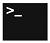 

### 2. Modello di dominio

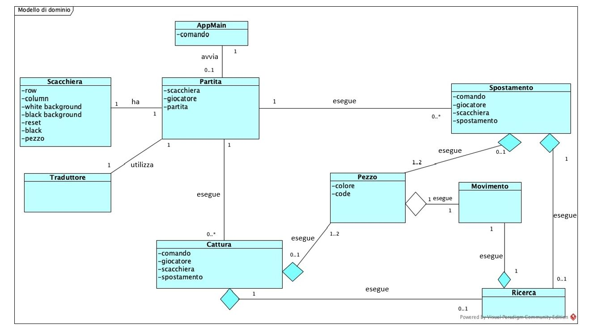

### 3. Requisiti specifici

#### Requisiti funzionali:

##### **-Gestione del pedone:**
  
* L'applicazione deve accettare mosse in notazione algebrica abbreviata in italiano;
* La mossa deve rispettare le regole degli scacchi;
* Il pedone può catturare pezzi;
* Il pedone può catturare en passant;
* Se una mossa non è valida è mostrato il messaggio "**Mossa illegale**", l'applicazione rimane in attesa di una mossa valida.

##### **-Gestione del cavallo:**

* L'applicazione deve accettare mosse in notazione algebrica abbreviata in italiano;
* La mossa deve rispettare le regole degli scacchi;
* Il Cavallo può catturare pezzi;
* Se una mossa non è valida è mostrato il messaggio "**Mossa illegale**", l'applicazione rimane in attesa di una mossa valida.

##### **-Gestione dell'alfiere:**

* L'applicazione deve accettare mosse in notazione algebrica abbreviata in italiano;
* La mossa deve rispettare le regole degli scacchi;
* L’Alfiere può catturare pezzi;
* Se una mossa non è valida è mostrato il messaggio "**Mossa illegale**", l'applicazione rimane in attesa di una mossa valida.

##### **-Gestione della torre:**

* L’applicazione deve accettare mosse in notazione algebrica abbreviata in italiano;
* La mossa deve rispettare le regole degli scacchi;
* La Torre può catturare pezzi;
* Se una mossa non è valida è mostrato il messaggio "**Mossa illegale**", l'applicazione rimane in attesa di una mossa valida.

##### **-Gestione della donna:**

* L'applicazione deve accettare mosse in notazione algebrica abbreviata in italiano
* La mossa deve rispettare le regole degli scacchi;
* La Donna può catturare pezzi;
* Se una mossa non è valida è mostrato il messaggio "**Mossa illegale**", l'applicazione rimane in attesa di una mossa valida.

##### **-Gestione del re:**

* L'applicazione deve accettare mosse in notazione algebrica abbreviata in italiano;
* La mossa deve rispettare le regole degli scacchi;
* La mossa è considerata illegale se porta il proprio Re sotto scacco, cioè non può muoversi in case minacciate da pezzi avversari
* Il Re può catturare pezzi;
* Se una mossa non è valida è mostrato il messaggio "**Mossa illegale**", l'applicazione rimane in attesa di una mossa valida.

##### **-Arrocco corto:**

* L’applicazione deve accettare mosse in notazione algebrica abbreviata in italiano;
* La mossa deve rispettare le regole degli scacchi;
* Se una mossa non è valida è mostrato il messaggio "**Mossa illegale**", l'applicazione rimane in attesa di una mossa valida.

##### **-Arrocco lungo:**

* L’applicazione deve accettare mosse in notazione algebrica abbreviata in italiano;
* La mossa deve rispettare le regole degli scacchi;
* Se una mossa non è valida è mostrato il messaggio "**Mossa illegale**", l'applicazione rimane in attesa di una mossa valida.

#### Requisito non funzionale:

##### -Scacco matto:

  E' una situazione del gioco degli scacchi nel quale il Re di uno dei giocatori è posto sotto diretto attacco (scacco) e non ha modo di   ripararsi con altri pezzi o muovere in una casella libera dalla minaccia di cattura immediata.

### 4. System Design

#### Stile architetturale

Lo stile architetturale adottato è di tipo **Model-View-Controller (MVC)** per sistemi interattivi, che separa la logica di presentazione dei dati (View) dalla logica di business (Model).

**-Model:**

* Include oggetti che rappresentano la conoscenza del dominio dell’applicazione
* Include i metodi per l’accesso ai dati

**-View:**

* Include la rappresentazione visuale dei dati
* Sono possibili viste multiple

**-Controller:**

* Gestisce la sequenza di interazioni con l‘utente
* Accetta l’input e lo trasforma in comandi per il modello o la vista
* Media tra gli oggetti del Model e le viste (View) che li rappresentano

  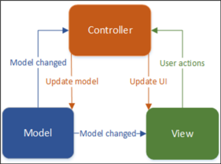

Seguendo lo stile architetturale MVC le classi sono state suddivise in:

**-Model classes:**
* AppMain;
* Partita;

**-View classes:**
* Scacchiera;
* GestoreStorico;

**-Controller:**
* Spostamento;
* Cattura;

**Diagramma dei package:**

Il progetto è stato suddiviso in tre package:
* Main, contenente solo il main dell'applicazione;
* General, contenente le classi relative all'esecuzione del gioco;
* Pezzi, contente le classi relative ai pezzi della scacchiera.

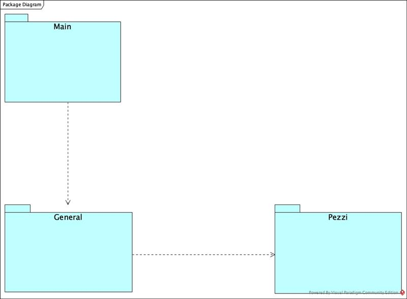
 

### 5. OO Design

#### Diagrammi delle classi e diagrammi di sequenza:

* **Diagramma classe Spostamento:**

* **Diagramma classe Cattura:**

* **Diagramma di sequenza Spostamento:**

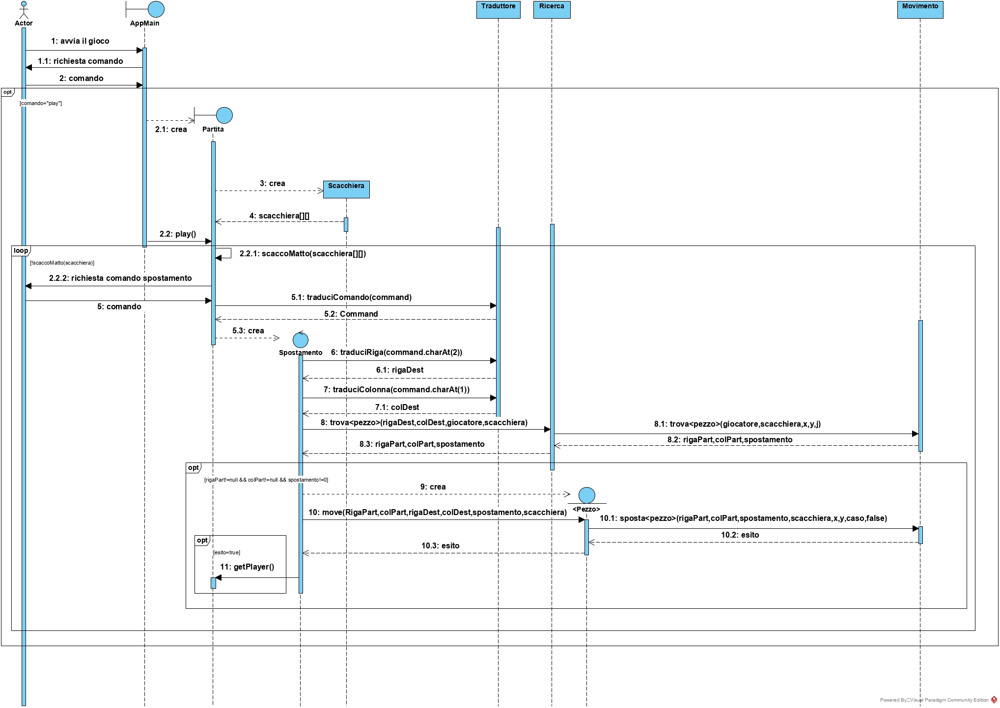 

* **Diagramma di sequenza Cattura:**

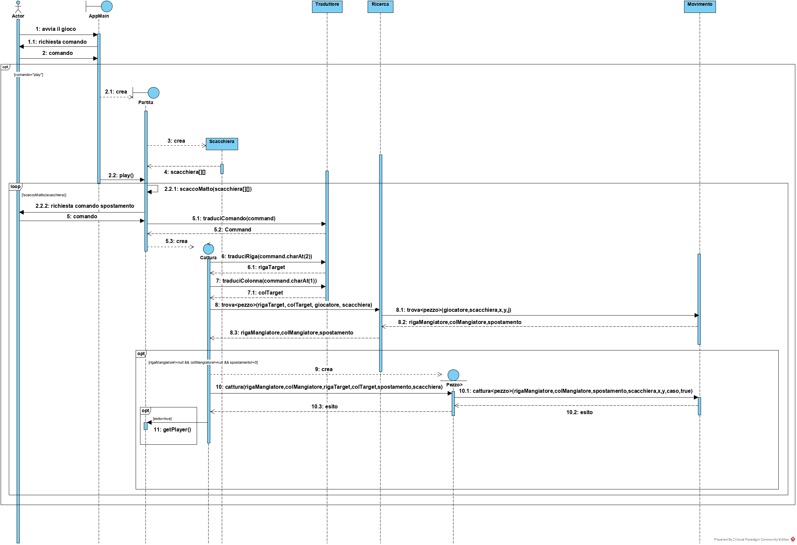

Dopo che l'utente ha avviato l'applicazione, gli viene richiesto di inserire un comando. Se inserisce il comando **play**, viene creata una nuova partita. 
Successivamente viene chiesto all'utente con i pezzi bianchi, di fare la prima mossa.

In generale, l'utente può decidere se effettuare una **cattura** o uno **spostamento**. 
In base al comando inserito, viene creata una nuova istanza di cattura o di spostamento.
Il comando inserito dall'utente viene tradotto e viene effettuata una ricerca partendo dalle coordinate di destinazione, ci si muove (tramite la classe movimento) all'indietro alla ricerca della posizione del pezzo di partenza.

Trovata la posizione la si utilizza per effettuare la mossa. 
Viene quindi invocata la classe relativa al pezzo che si vuole spostare e invocato il metodo relativo alla mossa (**move** o **cattura**).

Se la mossa va a buon fine, il turno passa all'avversario al quale viene richiesto di inserire un nuovo **comando**. 
La partita continua finchè non si verifica la situazione di scacco matto o finchè uno dei due giocatori non decida di abbandonare la partita.

### 6. Riepilogo dei test

Di seguito è riportato il riepilogo dei **test**, per visionare l'elenco completo [clicca qui](https://coveralls.io/github/softeng1920-inf-uniba/progetto1920-knuth).

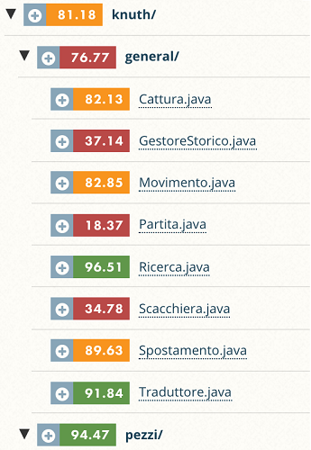   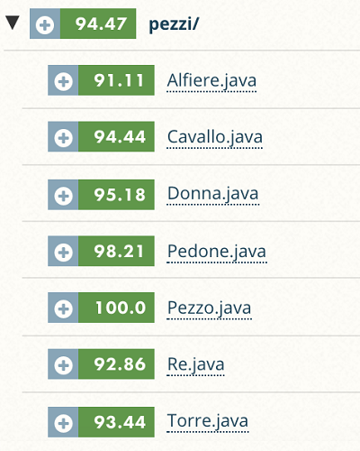

Si è deciso di non testare completamente tutte le classi in cui i test non sono necessari.

#### Package pezzi:

Package testato tralasciando solo getters and setters, con risultati **soddisfacenti**.

#### Package general:

Package testato con **ottimi** risultati e copertura di test escludendo parzialmente le seguenti classi:

* GestoreStorico (contenente per la maggior parte metodi di stampa);
* Scacchiera (metodo per la visualizzazione della scacchiera non testato);
* Partita (contente per esempio la gestione in input del comando ricevuto);

#### Package main:

* Appmain (inutilità del test).

### 7. Manuale utente

#### 7.1  Avvio del programma

L'avvio del programma è consentito tramite linea di comando, con l'utilizzo di Docker.

L'utente deve inserire i seguenti **comandi**: 
* "docker pull docker.pkg.github.com/softeng1920-inf-uniba/progetto1920-knuth/scacchi-knuth:latest" per scaricare l'ultima versione.
* "docker run -it docker.pkg.github.com/softeng1920-inf-uniba/progetto1920-knuth/scacchi-knuth:latest" per avviare il programma.

#### 7.2.0  Visualizzazione menù principale

All’avvio è possibile digitare uno dei seguenti comandi:
* **play** (per cominciare una nuova partita);
* **quit** (per chiudere definitivamente l’applicazione);
* **help** (per mostrare i comandi disponibili);

In caso di digitazione errata verrà mostrato il messaggio di "**Comando non valido**" e sarà possibile reinserire il comando.

#### 7.2.1   Cominciare una patita 

Inizializzazione di una nuova partita e visualizzazione della scacchiera. Entrambi i giocatori (“Bianco”  e “Nero”) cominciano la partita con **16 pezzi**: un re, una donna, due torri, due alfieri, due cavalli e otto pedoni.

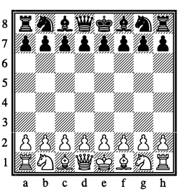

#### 7.2.2  Restart partita

Durante il gioco è possibile avviare una nuova partita digitando il comando "**play**", sovrascrivendo quella in corso.

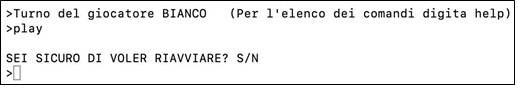

#### 7.2.3  Spostamento 

Il giocatore bianco fa la prima mossa.
Al proprio turno il giocatore deve specificare il pezzo che vuole spostare attraverso la notazione algebrica abbreviata in italiano (vedi 7.2.5 **comando help**).
Ogni pezzo si muove secondo le proprie caratteristiche sotto indicate:

(♔)  Il **Re** si muove di una casella per volta, in qualsiasi direzione: avanti, indietro, lateralmente e diagonalmente, se la posizione di destinazione è libera e non lo pone sotto scacco.

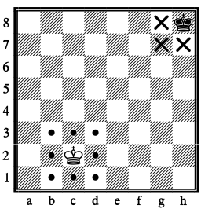

(♕)  La **Donna** si può muovere di un numero qualsiasi di caselle per volta in senso orizzontale, verticale o diagonale per il numero di case non occupate che trova.

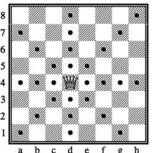

(♖)  La **Torre** si sposta in senso orizzontale o verticale, di un numero qualsiasi di caselle per volta, per il numero di case non occupate che trova.

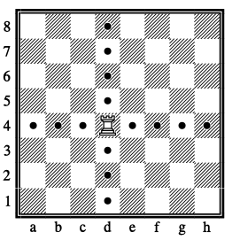

(♗)  L'**Alfiere** si muove in senso diagonale, di un numero qualsiasi di caselle per volta per il numero di case non occupate che trova.

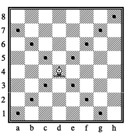

La Donna, la Torre e l’Alfiere non possono “scavalcare” un altro pezzo. La sola eccezione a questa regola è quando la Torre “scavalca” il Re, eseguendo l’arrocco.

(♘) Il **Cavallo** si sposta con un movimento a “L”: due caselle in senso orizzontale o verticale, poi una casella ad angolo retto. Il Cavallo è in grado di scavalcare gli altri pezzi (sia bianchi che neri). 

(♙) La mossa consueta del **Pedone** è lo spostamento di una casella ma solo in avanti, non può̀ retrocedere.
Solo in caso di prima mossa il pedone può effettuare uno spostamento di due caselle.

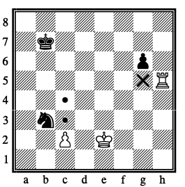

L’arrocco è una mossa che  si realizza con il Re e una delle due Torri (arrocco lungo/corto). Il Re si muove di due caselle verso la Torre, la Torre scavalca il Re e occupa la casella accanto al Re. 

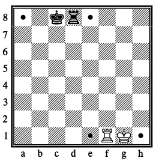

#### 7.2.4  Cattura

##### 7.2.4.1 Cattura semplice

Se si vuole catturare un pezzo l’utente deve digitare sulla tastiera seguendo la seguente notazione algebrica:
([ADTCR | a-h])(x)([a-h])([1-8]) con una lettera il pezzo che vogliamo utilizzare (in caso del pedone solo la colonna di partenza) e la casella di destinazione.
Il simbolo (“x”) sta ad indicare che vogliamo eseguire una cattura del pezzo avversario.

##### 7.2.4.2  Cattura en passant 

Questa regola nasce dalla mossa del passo doppio del pedone.
Se dopo una mossa a passo doppio, un pedone si trova a fianco a un pedone avversario, quest’ultimo può catturare l’altro pedone come se la mossa fosse stata di una casella. 
Questa mossa si effettua esattamente come una cattura dopo una singola mossa. Per poter eseguire questa cattura l’utente digita sulla tastiera il comando nella seguente notazione algebrica: ([a-h])(x)([a-h])([1-8]) (e.p.)?

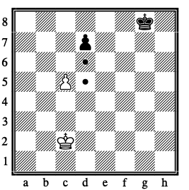

#### 7.2.5  Comando help

L’utente può digitare sulla tastiera durante il suo turno il "**comando help**" in modo tale da poter visualizzare tutti i comandi possibili che si possono digitare durante la partita.

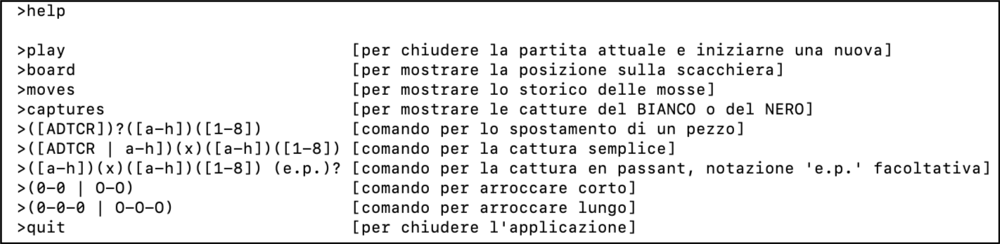

* **Board** mostra la posizione corrente dei pezzi sulla scacchiera:

  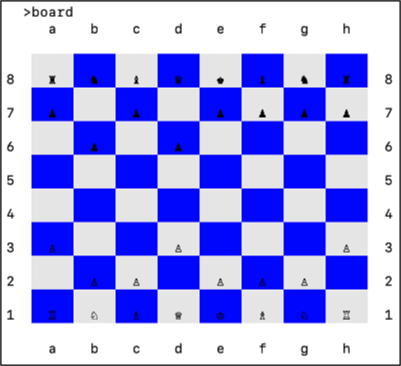

* **Moves** mostra lo storico delle mosse:

  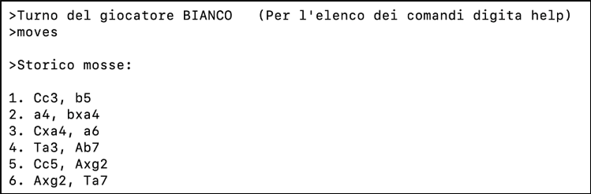

* **Captures** mostra le storico delle catture effettuate dal bianco e dal nero:

  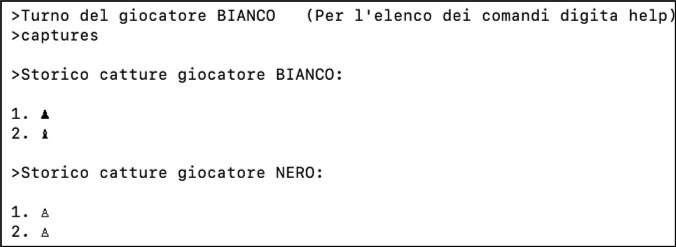

#### 7.2.6  Chiusura partita.

L’utente può decidere durante il suo turno di abbandonare la partita tramite il comando "**quit**", successivamente verrà chiesto se si vuole davvero uscire definitivamente dal gioco scegliendo tra la digitazione di "**S**" per confermare o di "**N**" per non chiudere il gioco.

### 8. Processo di sviluppo e organizzazione del lavoro

Il tipo di sviluppo adottato è di tipo **agile**, una tipologia fortemente adattiva rispetto ai cambiamenti in corso d’opera con poca documentazione. Importante è la **comunicazione diretta** tra persone.

Lo stile di processo associato è di tipo **iterativo**, con iterazioni corte e di durata costante.
E' conosciuto anche come processo incrementale, a spirale, evolutivo e suddivide il progetto in base a sottoinsiemi di funzionalità (iterazioni).
L’inizio delle iterazioni è preceduto da una fase esplorativa, ed ogni iterazione produce codice (build) testato e integrato nel sistema complessivo. 
Le iterazioni messe in produzione sono dette **release**, rilasciate a intervalli di tempo regolari.

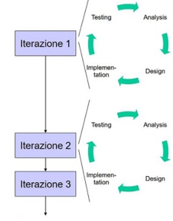   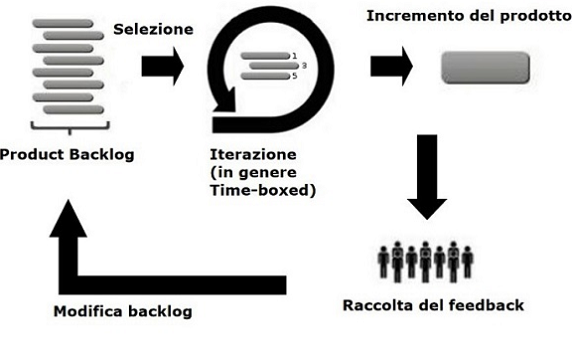

Il metodo agile previsto è di tipo Scrum. 
Il progetto è frutto di 4 sprint (incluso Sprint 0 di familiarizzazione su github) di durata costante pari a due settimane.

**Ruoli**:
* Product owner: Prof. Filippo Lanubile;
* ScrumMaster: Prof. Filippo Lanubile;
* Team knuth: Luigi Mangione, Savino Marzano, Nicolò Prodon, Lorenzo Sinisi, Antonio Volpicella.

Il **product backlog** contenente la lista di tutto il lavoro richiesto sul progetto è stato organizzato dal product owner che ne ha stabilito le priorità all'inizio di ogni sprint.

**Sprint goal**:
* Sprint 0: Dimostrare familiarità con GitHub e il processo agile;
* Sprint 1: Apertura partita con soli pedoni;
* Sprint 2: Mediogioco;
* Sprint 3: Comunicare la qualità del lavoro svolto.

**Sprint 0 backlog**
* Modificare il file markdown README per aggiungere il badge di Coveralls - Luigi Mangione
* Modificare il file markdown README per aggiungere il badge di GitHub Actions. - Luigi Mangione
* Applicare la patch fix_github_actions_workflow.patch - Antonio Volpicella
* Applicare la patch fix_student_guide.patch - Nicolò Prodon
* Modificare il file markdown Guida per lo studente, personalizzando le figure in cui compare un nome di repository diverso dal proprio, oppure uno username o immagine di profilo diverso da quello dei componenti del gruppo - Lorenzo Sinisi
* Modificare il file markdown Assegnazione progetto riportando il contenuto dell'ultima slide di Presentazione del corso - Savino Marzano

**Sprint 1 backlog**
* Mostrare elenco comandi - Antonio Volpicella
* Iniziare una nuova partita - Savino Marzano
* Chiudere il gioco - Lorenzo Sinisi
* Mostrare la scacchiera - Savino Marzano
* Muovere un pedone - Luigi Mangione
* Mostrare le mosse giocate - Nicolò Prodon
* Visualizzare le catture - Nicolò Prodon

**Sprint 2 backlog**
* Muovere un Cavallo - Lorenzo Sinisi
* Muovere un Alfiere - Savino Marzano
* Muovere una Torre - Nicolò Prodon
* Muovere la Donna - Antonio Volpicella
* Muovere il Re - Savino Marzano
* Arrocco corto - Luigi Mangione
* Arrocco lungo - Luigi Mangione

**Sprint 3 backlog**
* Introduzione - documentation - Lorenzo Sinisi
* Modello di dominio - documentation - Antonio Volpicella / Nicolò Prodon
* Requisiti specifici - documentation - Antonio Volpicella / Nicolò Prodon
* System Design - documentation - Nicolò Prodon / Savino Marzano
* OO Design - documentation - Savino Marzano
* Riepilogo dei test - documentation - Luigi Mangione / Lorenzo Sinisi
* Manuale utente - documentation - Antonio Volpicella
* Processo di sviluppo e organizzazione del lavoro - Luigi Mangione / Nicolò Prodon / Antonio Volpicella
* Analisi Retrospettiva - Nicolò Prodon

Giornalmente è stato effettuato un **meeting** tra i soli membri del Team in cui si è pianificato il lavoro, fatto il punto della situazione e sciolto dubbi. 

Durante le fasi di **sprint review** il team ha ricevuto i risultati raggiunti dalla demo contenente le nuove funzionalità.
Durante le fasi di **sprint retrospective** il team si è confrontato su cosa introdurre, come continuare e cosa evitare.

I programmi utilizzati per le fasi di meeting, sprint review e sprint retrospective sono stati Slack e Microsft Teams.
IDE utilizzato è Eclipse Java Development 2020-03.

  

Durante lo sviluppo, quando è stato necessario un cambiamento si è provveduto all'approvazione del cambiamento attraverso un **feedback veloce**.

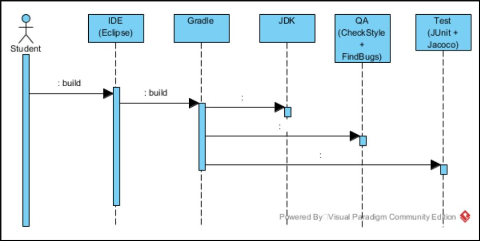

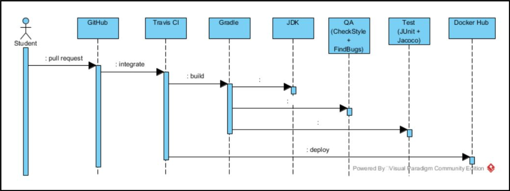

### 9. Analisi retrospettiva

* Nello Sprint 0 il team ha poco apprezzato il lavoro generalmente svolto in quanto "sufficiente". Le lacune iniziali sono state di grande esperienza per il proseguo del progetto (Sprint 0: 3/5);

* Nello Sprint 1 il team si è rammaricato per due minor (dovuti a disattenzioni sulle user story "Mostrare le mosse giocate" - "Visualizzare le catture" che hanno condizionato la valutazione quasi perfetta da parte del product owner (Sprint 1: 4/5).

* Nello Sprint 2 il team è risultato generalmente soddisfatto per il lavoro svolto, ripagato con valutazione perfetta da parte del product owner (Sprint 2: 5/5).

* Nello Sprint 3 il team è stato molto unito e la suddivisione del lavoro ben condivisa da parte di tutti i membri.

Generalmente durante le fasi di sprint retrospective il team è risultato **contento** del miglioramento costante delle funzionalità del progetto e dell'efficienza in crescendo del lavoro svolto, valorizzato dalla ricezione di feedback altrettanto crescenti da parte del product owner.

**Positivo** è stato il rapporto tra i membri del team, molto affiatato, con scelte sempre condivise.
Pertanto, si è operati sempre in un ambiente sereno e basato sulla crescita sia individuale (attraverso consigli e critiche costruttive) che collettiva (riunioni puntuali e rispetto dei ruoli interni).

**Faticoso**, è stato rimediare a sviste che hanno portato ad errori di checkstyle all'interno dello Sprint 3.
In particolare molti di tipologia "Magic number" sparsi su parte del codice (errori risolti).
Un altro errore faticoso da risolvere è stato l'utilizzo di metodi con più di 7 parametri, in particolare 4 erorri che non si son potuti risolvere a causa dell'importanza dei parametri stessi.

Durante la produzione del codice, tra le parti che hanno dato qualche piccola **difficoltà** che hanno reso più lenta la produzione del software spiccano:

* Gestione dello scacco matto;
* Gestione dell'En Passant;
* Algoritmi di ricerca dei pezzi;
* Utilizzo di uno scanner temporaneo per la rilevazione di più di un pezzo possibile da spostare nella classe torre.

Per un breve periodo un improvviso aggiornamento del programma "Windows Terminal" ha provocato una incorretta visualizzazione del pedone nero sui dispositivi Windows, provocando **panico** improvviso nel team.
Successivamente un ulteriore aggiornamento da parte degli sviluppatori del programma "Windows Terminal" ha risolto questo bug non imputabile a nessun membro del team knuth.

In conclusione il progetto è stato portato a termine in modo del tutto **funzionante** e rispettoso delle richieste assegnate, con ogni componente del gruppo soddisfatto del proprio operato.
